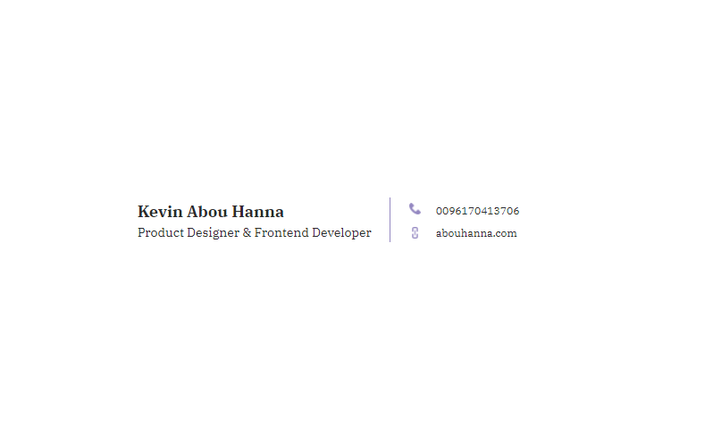

# Email Signature Template

[](https://github.com/kevinabouhanna/Email-Signature-Template/) [](https://github.com/kevinabouhanna/Email-Signature-Template/) [](https://github.com/kevinabouhanna/Email-Signature-Template/)

#### Sometimes, creating an attractive email signature is essential. Here's an eye-catching HTML signature [example](https://kevinabouhanna.github.io/Email-Signature-Template/index.html) to realize that the signature can be not boring, but eye-catching, elegant and recognizable.

## Usage

Use [this](https://github.com/kevinabouhanna/Email-Signature-Template/) repository to create HTML email signature that is properly designed, attractive and informative. 

Clone [this](https://github.com/kevinabouhanna/Email-Signature-Template/) repository and edit `index.html` to get your own email signature.

```bash

git clone https://github.com/kevinabouhanna/Email-Signature-Template/ 
open index.html

```

> Follow [this](https://pdf.wondershare.com/signature/insert-html-signature-in-gmail.html) to add signature to Gmail. Check [this](https://www.christopherbolt.com/support/knowledgebase/24/Installing-HTML-email-signatures-in-Microsoft-Outlook.html) out for installing HTML signature in Outlook.


## Signature Preview



## Demo

Click [here](https://kevinabouhanna.github.io/Email-Signature-Template/index.html) to view the live demo.

## Example

Click [here](https://kevinabouhanna.github.io/Email-Signature-Template) to view a sample email template with this signature.

## Contributing

[](https://github.com/kevinabouhanna/Email-Signature-Template/issues) 

- Fork/clone this repository.

```
git clone https://github.com/kevinabouhanna/Email-Signature-Template.git
```

- **Add a new template for email signature.** Follow the same coding style as `index.html`.

- Name your file as `new_template_your_github_username.html` and send the PR.


## Thanks

Glad to see here! Show some love by [starring](https://github.com/kevinabouhanna/Email-Signature-Template/) this repository.

[](https://fayz.in/stories/s/1522/0/?ckt_id=ZGL1ZGVk&title=story_of_kevinabouhanna)[](https://medium.com/@kevinabouhanna)[](https://www.linkedin.com/in/kevinabouhanna/)[](https://www.linkedin.com/in/kevinabouhanna/)[](https://www.linkedin.com/in/kevinabouhanna/)[](https://www.linkedin.com/in/kevinabouhanna/)[](https://medium.com/@kevinabouhanna)[](https://medium.com/@kevinabouhanna)

[](https://github.com/kevinabouhanna/) [](https://twitter.com/kevinabouhanna)
